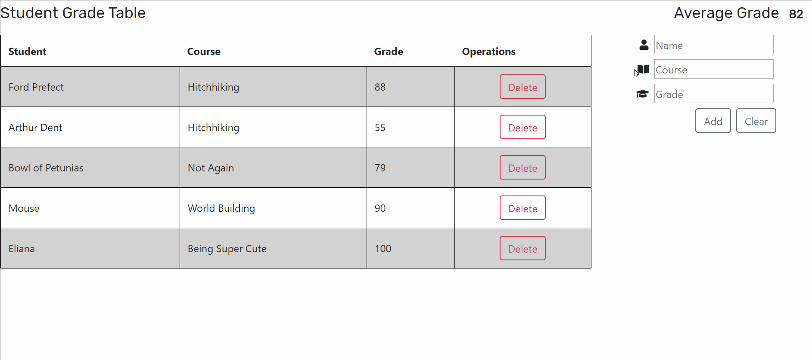

# Gradebook

A full stack JavaScript application for teachers who want to manage course records.

## Technologies Used

- React.js
- Webpack 4
- Bootstrap 4
- Node.js
- mySQL
- HTML5
- CSS3
- AWS EC2

## Live Demo

Try the application live at [https://gradebook.slightlyskewedcreations.com](https://gradebook.slightlyskewedcreations.com)

## Features

- Teachers can view a list of recorded grades.
- Teachers can view the average grade.
- Teachers can add a grade to the table.
- Teachers can delete a grade from the table.

## Preview



## Development

#### System Requirements

- Node.js 10 or higher
- NPM 6 or higher
- mySQL 5 or higher

#### Getting Started

1. Clone the repository.

    ```shell
    git clone https://github.com/rbolet/gradebook.git
    cd gradebook
    ```

1. Create a new mySQL database named 'gradeTable.'

1. Install all dependencies with NPM.

    ```shell
    npm install
    ```

1. Import table structure and starter data

    ```shell
    mysql -u <your username> -p gradeTable < ./database/sgtdump.sql
    ```

1. Start the project. Once started you can view the application by opening http://localhost:3030 in your browser.

    ```shell
    npm run dev
    ```
